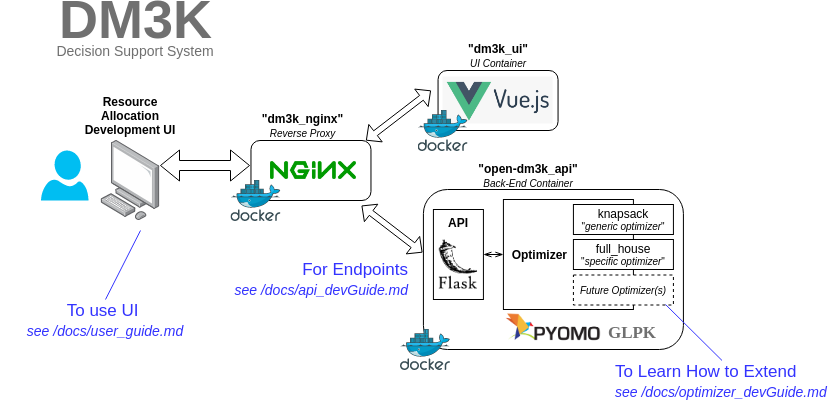

# OPEN DECISION MAKER 3000

The Open Decision Maker 3000 (OPEN-DM3K) is a generalized decision-engine that solves complex resource allocation problems.

> **NOTE** - For more explanation of resource allocation problems and their component parts, see [*/docs/resource_allocation_101.md*](/docs/resource_allocation_101.md)

OPEN-DM3K provides the user with:

- a web-based UI to define their resource allocation problem.
- a python optimizer that leverages linear optimization techniques to solve the user defined problem.



## Installation

### Prerequisites

Installation assumes you have...

- docker (v19.03+)  see https://docs.docker.com/get-docker/
- docker-compose (v1.27+)  see https://docs.docker.com/compose/install/

### Installation Procedure

from the main directory of the repo run...
```bash
$ sudo docker-compose -f docker-compose.yml up --build -d
```

> **NOTE** this make take a while....please be patient

To confirm the installation, run...

```bash
$ sudo docker ps
```

Output of this command should show 3 docker containers: dm3k_open_api, dm3k_open_ui, dm3k_open_nginx as shown below...

STATUS                  |  PORTS                |   NAMES       
------------------------|-----------------------|---------------
Up 2 minutes (healthy)  | 0.0.0.0:80->80/tcp    | dm3k_open_nginx
Up 2 minutes            | 9000/tcp              | dm3k_open_api
Up 2 minutes            | 80/tcp                | dm3k_open_ui


To confirm the health of the optimizer, run the following command:

```bash
$ sudo docker exec -ti dm3k_open_api python -m unittest discover -v -s /app/tests/test_optimizer
```

To stop OPEN-DM3K, run...
```bash
$ sudo docker-compose -f docker-compose.yml down
```

## Usage

Connect to the UI by pointing your web browser to:  http://{hostname} 

where hostname is the name or ip address of the machine that is running docker.

For details on how to use the UI to create/solve resource allocation problems see [*/docs/user_guide.md*](/docs/user_guide.md)

## Contributing

Pull requests are welcome. For major changes, please open an issue first to discuss what you would like to change.

Please make sure to update tests as appropriate.

For developers guide, see 

- [*/docs/dev_env.md*](/docs/dev_env.md) or
- [*/docs/api_devGuide.md*](/docs/api_devGuide.md) or 
- [*/docs/optimizer_devGuide.md*](/docs/optimizer_devGuide.md)

Depending on how you wish to contribute

## License

(c) Johns Hopkins University Applied Physics Laboratory. All Rights Reserved.

This material may only be used, modified, or reproduced by or for the
U.S. government pursuant to the license rights granted under FAR
clause 52.227-14 or DFARS clauses 252.227-7013/7014.
For any other permission, please contact the Legal Office at JHU/APL.

For more details, see [LICENSE](./LICENSE) file
