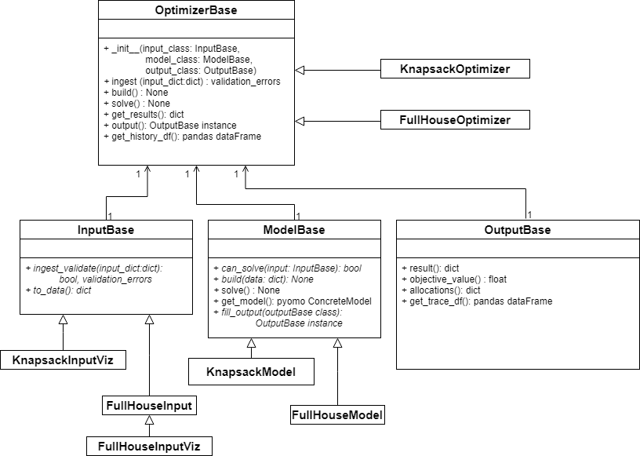

# Optimizer Development and Extension Guide #

The optimizer is one of the core pieces of functionality of Open-DM3K.  It takes in the problem definition, performs integer programming optimization of the problem, and returns the results of the optimization.

This document describes the component parts of the optimizer and how others can add new optimizers to the existing system.

Table of Contents:

[[_TOC_]]

## Optimizer Design ##

The optimizer is based on a flexible software design with the goal to make it easy to create new optimizers.

The core classes are shown in the diagram below.

### Core Classes ###

**OptimizerBase** represents the overall optimizer itself and coordinates the input, model, and output classes.  This class provides methods that outline the process for ingesting data, building a model, solving the model, and getting output from the model results.

**InputBase** is the base class for handling the resource allocation problem definition input. It provides a layer between the standardized input and the data format an optimizer needs to build and run the model.  The key method in this class is the *ingest_validate* method which is used to validate the input and convert the input into the format used by the optimizer.

**ModelBase** is the base class for the optimizer model and serves as a template for the meat of new optimizers.  These will typically extend the base class and build a new pyomo model using input data.  Within this class exists code to identify how to turn the input data into appropriate pyomo constraints.  Extensions of this class will have to implement the: *can_solve*, *build*, and *fill_output* methods.

**OutputBase** is the base class for holding output from an optimizer solution.  It provides a layer between the standardized output and the optimizer solution.  For Open-DM3K and additional future extensions, this class does not need to be extended.  Only if users modify the UI will this class need to be extended to support the new data or data format in a future UI.

## How to Extend the Optimizer ##

The developers of this repo want to encourage the development of new and better optimizers and therefore provide a way to extend this system.

For an example how to extend, refer to the Full House optimizer (located in /optimizer/full_house).  This is our original extension of the generic optimizer (located in /optimizer/knapsack).  The Full House was developed to be a faster way to solve a specific type of resource allocation problem; problems with 3 resources (1 parent and 2 children) and 2 activities (1 parent and 1 child) linked together with a "Contains IF-THEN" allocation constraint.  (*Full House comes from the 3 resources and 2 activities*)

If you wish to create your own optimizer, the following process defines how to extend the existing system:

1. Create a new folder in the /optimizer directory, and within that folder place the following classes.
2. Create a new class that is a subclass of **optimizer.slim_optimizer_base.InputBase** and develop the following methods:
   1. *ingest_validate*:  develop this method so that the problem definition input format (see [api guide](/docs/api_devGuide.md) for problem input format) is converted into whatever format you need to construct your model.  Place the converted input information into the self._data field.
3. Create your pyomo model including objective and constraint functions.  These can be added to the module that will contain your subclass of ModelBase (see next step)
4. Create a new class that is a subclass of **optimizer.slim_optimizer_base.ModelBase** and develop the following methods:
   1. *can_solve*: there may be problems that your system cannot solve.  Use this function to indicate which problems your optimizer cannot solve.
   2. *build*: develop this method to take in data from your InputBase subclass and construct your pyomo model based on objectives and constraints you defined.
   3. *fill_output*: develop this method to translate your output to the output format (see [api guide](/docs/api_devGuide.md) for problem output format)
5. Create a subclass of the **optimizer.slim_optimizer_base.OptimizerBase** class.  Only instantiate the init function by indicating your subclass of InputBase, your subclass of ModelBase, and the standard OutputBase class.  
6. In the **optimizer.slim_optimizer_main** module. Add your optimizer to the global variable "algorithm_dict" by following the pattern already in place.  This will allow your optimizer to be available to be selected when an optimizer is instantiated.
