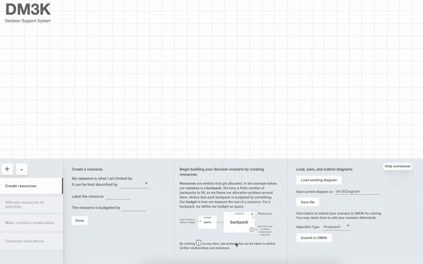
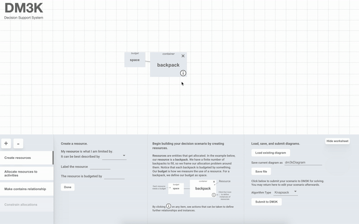
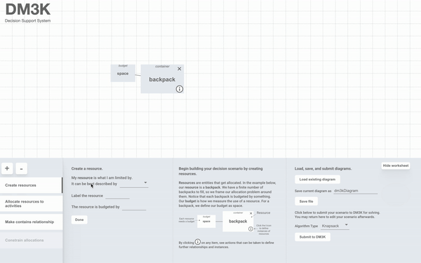
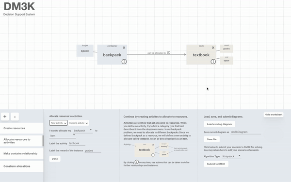
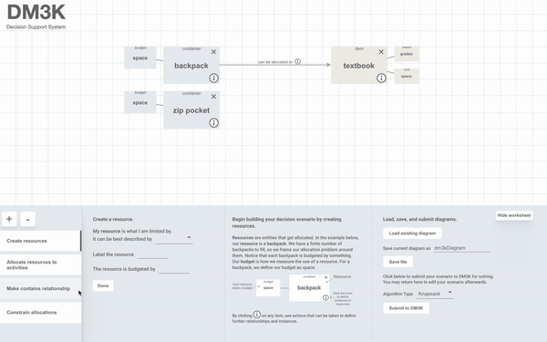
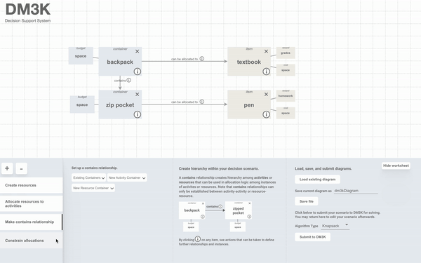
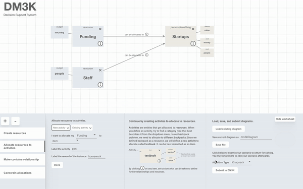

# DM3K User Guide #

This user guide describes how to use the User Interface (UI) to create and solve resource allocation problems.

Upon navigating to the UI, the top pane provides a *canvas* and the bottom pane provides a *worksheet* to add to the canvas.

Table of Contents:
* [Create resource class](#create-resource-class)
* [Create resource instances](#create-resource-instances)
* [Allocate resources to activities](#allocate-resources-to-activities)
* [Create activity instances](#create-activity-instances)
* [Make a contains relationship](#make-a-contains-relationship)
* [Constrain allocations](#constrain-allocations)
* [Submit diagram to solver](#submit-diagram-to-solver)

### **Create resource class**
The first step in defining an allocation problem is to create your *resources*.

The default tab of the worksheet is 'Create resources'.  To create a resource class, select its type from the dropdown and enter the label and budget name.  After you click 'Done', a box representing the resource class will appear on the canvas.  Repeat the process to make multiple resource boxes, which can be dragged around on the canvas.

### **Create resource instances**
The UI creates a single instance of each resource type by default.  You can add additional instances of these resources via the i-button on the resource class box.  Click to change the names of each instance and the amount of allocated budget.

### **Allocate resources to activities**
After creating resources, you may create activities by allocating your resources.  As for resources, select from the dropdown options and enter labels. 

Once you create at least one resource-activity pair, you will be able to allocate new resources to the same activities, as well as access all subsequent worksheets.

### **Create activity instances**
Create instances of your activities in the same way as resources.

You may define instance-level allocation relationships by clicking the i-button on the allocation arrow itself and access the dropdown menus for each instance.

The default instance-level allocation is ALL to ALL. This means *any* resource instance may be allocated to *any* activity instance.

### **Make a contains relationship**
A contains relationship is distinct from an allocation relationship. It can only be made between a pair of resources, or a pair of activities.

This type of relationship will impact the Optimal Allocation Plan if it constrains allocations.

### **Constrain allocations**
A constraint is a relationship between allocations themselves. There are three provided types of constraints: IF-THEN, IF-NOT, and IF-ONLY.
Constraints mean a target allocation can happen conditionally on the source allocation:
* Contained IF-THEN: if the source allocation is chosen, then the target allocation becomes possible.
* IF-NOT: if a resource type is allocated to one type of activity, it cannot be allocated to another type.
* IF-ONLY: in order for a resource type to be allocated to one type of activity, it must also be allocated to another type.

For more description of these, see the [guide to resource allocation](./resource_allocation_101.md).

### **Submit diagram to solver**
Once your allocation problem is complete, you can save the configuration to a file on your system by clicking 'Save file'.  You should then see a download of dm3kDiagram.json.

To submit the problem to the backend solver, select the algorithm type and click "Submit to DM3K".

A window will pop up showing a visualization of the result- aka the Optimal Allocation Plan.

This visualization includes a guide on how to interpret it. It is also rich in hover information.

